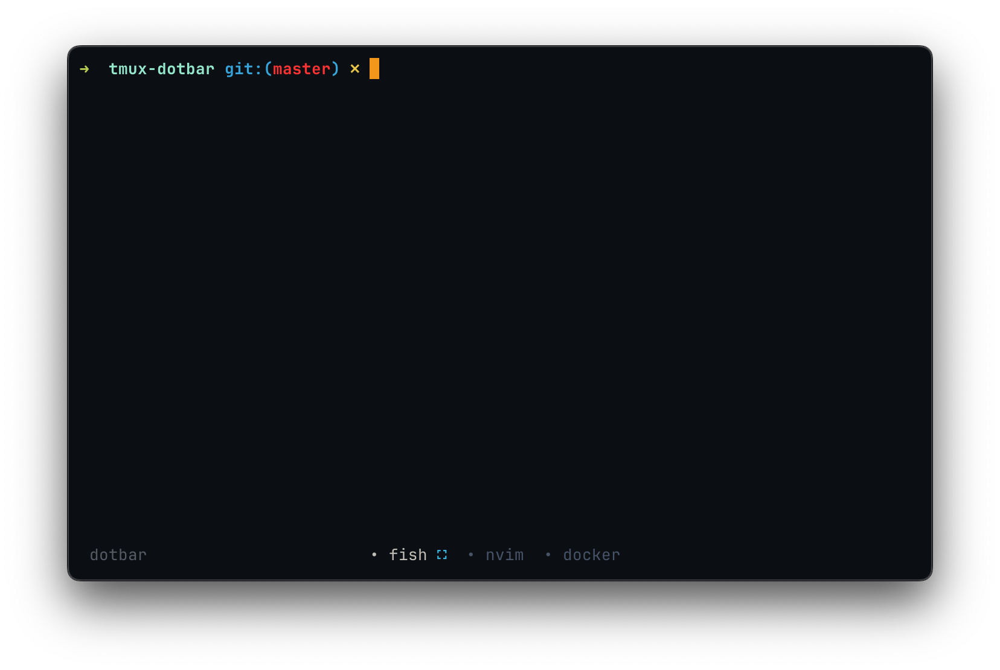
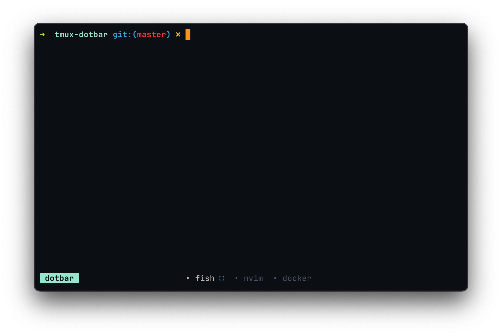

<div align="center">

<h1> tmux dotbar </h1>

tmux dotbar is a simple and minimalist status bar theme for tmux. <br>

[](./LICENSE)

</div> 

## Preview
<div align="center">
  
  
</div>


## Features
* Icon indicator when a pane is maximized in a window
* Color indication when tmux prefix is pressed

## Installation
### TPM (Recommended)
1.  Install [TPM](https://github.com/tmux-plugins/tpm)
2.  Add the plugin:

    ```bash
    set -g @plugin 'vaaleyard/tmux-dotbar'
    ```
3. Inside tmux, use the tpm install command: `prefix + I` (default prefix is ctrl+b)

<details>
    <summary font-size=18px>
        <h3>Manual</h3>
    </summary>

1. Clone this repository to your desired location (e.g. `~/.config/tmux/plugins/tmux-dotbar`).

   ```bash
   mkdir -p ~/.config/tmux/plugins/
   git clone https://github.com/vaaleyard/tmux-dotbar.git
   ```
2. Add the following line to your `tmux.conf` file:
   `run ~/.config/tmux/plugins/tmux-dotbar/dotbar.tmux`.
3. Reload Tmux by either restarting or reloading with `tmux source ~/.tmux.conf`.

</details>

## Option reference
This theme works best depending on the colorscheme you use.
The default colorscheme used for this theme is [neovim-ayu](https://github.com/Shatur/neovim-ayu), so it matches the background for my tmux, terminal and vim colors.  
If you want to change to match your colorscheme, you can get the colors and change/set these options:
```
# supposing you use catppuccin moccha
set -g @tmux-dotbar-bg "#1e1e2e"
set -g @tmux-dotbar-fg "#585b70"
set -g @tmux-dotbar-fg-current "#cdd6f4"
set -g @tmux-dotbar-fg-session "#9399b2"
set -g @tmux-dotbar-fg-prefix "#cba6f7"
```

## Recommended tmux options
Since this theme does not display window indexes, it's best suited for users who manage a small number of windows.  
To improve usability, it's hugely recommended to enable automatic renumbering when windows are closed.  
Also a good option is to start window indexes at 1 for easier tracking.

```
set-option -g renumber-windows on
set -g base-index 1
setw -g pane-base-index 1
```

### Credits
This theme was inspired on [minimal-tmux-status](https://github.com/niksingh710/minimal-tmux-status/tree/main).
