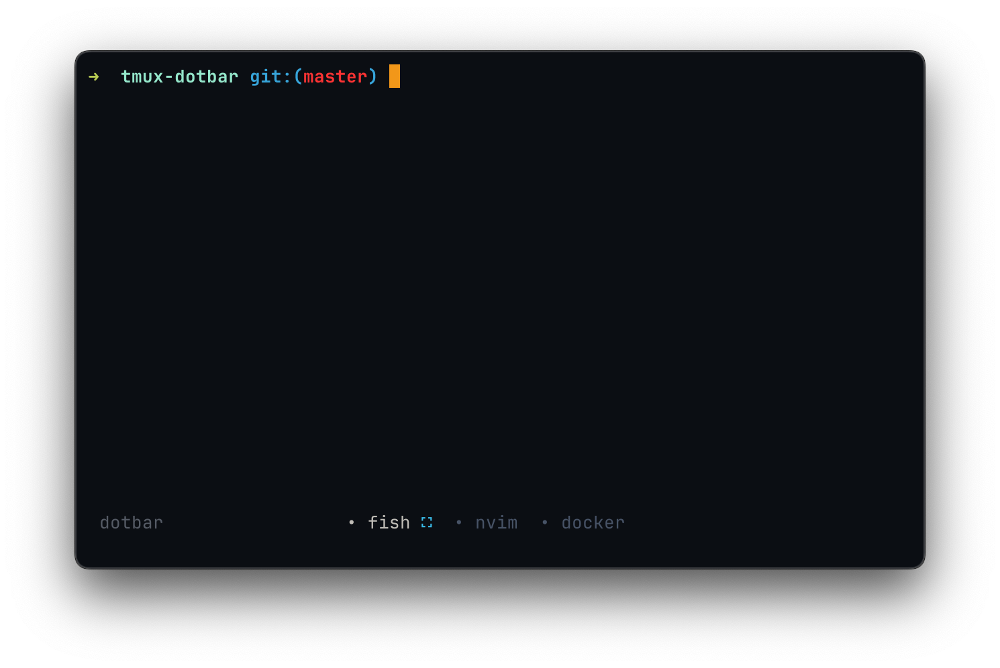

<div align="center">

<h1> Tmux dotbar </h1>

Tmux dotbar is a simple and minimalist status bar theme for tmux. <br>
The session name is changed when the prefix key is pressed. <br>

<br>


[](./LICENSE)

</div> 

## Preview
<p align="center">
<div align="center">

 

</div>
</p>

## Installation
### TPM (Recommended)
1.  Install [TPM](https://github.com/tmux-plugins/tpm)
2.  Add the plugin:

    ```bash
    set -g @plugin 'vaaleyard/tmux-dotbar'
    ```
3. Inside tmux, use the tpm install command: `prefix + I` (default prefix is ctrl+b)

### Manual
1. Clone this repository to your desired location (e.g. `~/.config/tmux/plugins/tmux-dotbar`).

   ```bash
   mkdir -p ~/.config/tmux/plugins/
   git clone https://github.com/vaaleyard/tmux-dotbar.git
   ```
2. Add the following line to your `tmux.conf` file:
   `run ~/.config/tmux/plugins/tmux-dotbar/dotbar.tmux`.
3. Reload Tmux by either restarting or reloading with `tmux source ~/.tmux.conf`.

## Recommended tmux options
Since this theme does not display window indexes, it's best suited for users who manage a small number of windows.  
To improve usability, consider starting window indexes at 1 for easier tracking.
It's also recommended to enable automatic renumbering when windows are closed.

```
set -g base-index 1
setw -g pane-base-index 1
set-option -g renumber-windows on
```

